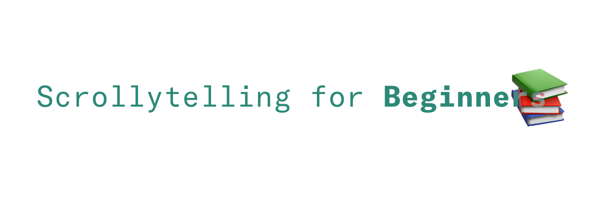

**Scrollytelling for beginners** is a collection of code, resources and tutorials
for the FH Potsdam students to help them dive in the topic of scrollytelling and
scroll controlled narratives.

In this repository you will find:
* A list of tutorials covering the basic concepts behind scrollytelling and its
technical implementation
* A collection of resources from other authors, from js libraries to articles and
notable examples
* Plug-and-play templates to practically approach scrollytelling in a fun and light way

## Tutorials
You can access all the theory articles here on our [Medium page](https://medium.com/@scrollyforbeginners).
Theory articles are introducing some useful concepts for the practice sessions.

**Available articles**
* [Scrollytelling for Beginners # 1](https://medium.com/@scrollyforbeginners/scrollytelling-for-beginners-1-551c5bad9631): *Theory — Javascript, Libraries and Frameworks*
* [Scrollytelling for Beginners # 2](https://medium.com/@scrollyforbeginners/scrollytelling-for-beginners-2-fa91901a9746): *Theory - Import data, scale them and draw some figures*
* [Scrollytelling for Beginners # 3](https://medium.com/@scrollyforbeginners/scrollytelling-for-beginners-3-73506cb84165): *Theory — CSS and Vue transitions, Scrollama*

## Resources
In [`resources/`](resources) you can find a collection of markdown files:
* [`resources/foundations.md`](resources/foundations.md) contains articles, tutorials and other resources to learn the foundations of JS and other tricks
* [`resources/random.md`](resources/random.md) is just cool stuff
* [`resources/libraries.md`](resources/libraries.md) will contain a selection of interesting js libraries.

**Coming soon**
* `resources/scrollytelling.md` will contain a collection of scrollytelling pieces.

## Code

A basic (works local without the need to build things or even a server) scrollytelling template. See [`code/solutions`](code/solutions) for exercises solutions step by step.


### Getting Started (Basic)
------
Open `S01-Intro/index.html` in your browser. start editing the files in [`S01-Intro/`](code/S01-Intro)
in any code editor to change things.

### Getting Started (Advanced)
------
#### light-server with node/npm
This requires some experience in using a command line as well as having node/npm
installed, but it gives the advantage to auto-reload pages when files are changed
and enables linting to keep your code nice and tidy.

install packages in the project directory
```
npm i
```

start a server
```
npm run serve
```
---

#### Python's SimpleHTTPServer
Follow [this guide](https://developer.mozilla.org/en-US/docs/Learn/Common_questions/set_up_a_local_testing_server) to fully understand what are you doing and/or install python.

If you already have python installed, in the `code` directory run:

```python
python -V
```
To check your python version.

Enter the command to start the server in the directory:
```python
# If Python version returned above is 3.X
python3 -m http.server
# On windows try "python" instead of "python3", or "py -3"
# If Python version returned above is 2.X
python -m SimpleHTTPServer
```
---

#### Atom's Package atom-live-server
If you are using Atom:
* go to Preferences > Packages > in the search bar type 'atom-live-server' > Install and/or Enable
* In the menu bar go to Packages > atom-live-server > Start server
