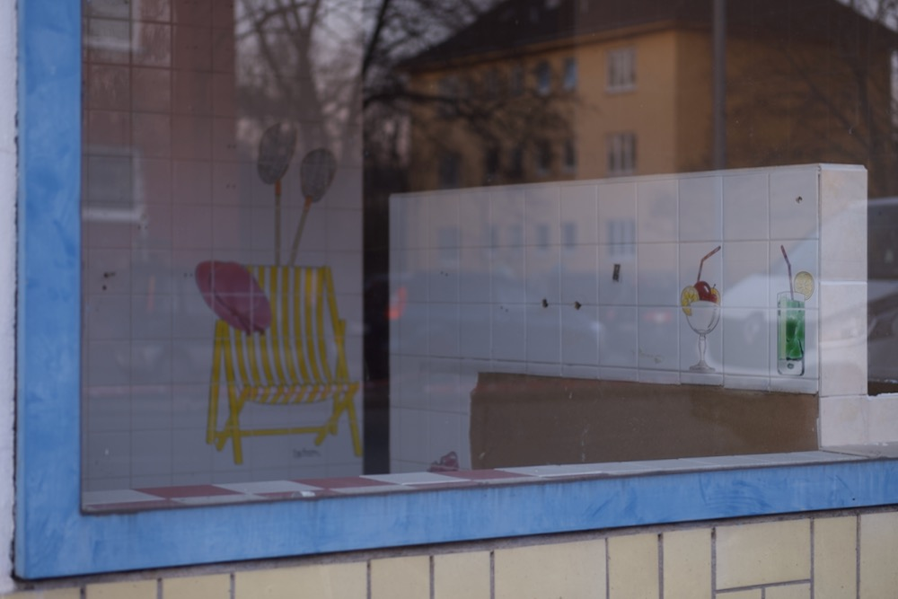

**Session #1**
### How does our template works?

In this session we will work on the template.
We will understand how to add new blocks for text, how to incorporate and edit svg elements and how to hide or show custom elements during the scroll.

---

#### Exercise 1
Add a custom block of text in the `index.html` file.  

**Step 1** - Open the `S01-Intro` folder in your code editor of choice. You can open the editor and drag the folder or (in Atom): File > Add project folder > select the folder.

**Step 2** - Open `index.html` in your preferred browser. Open the same file in your code editor.

As you can see the template is divided in two main sections:

```html
<figure ref="figure">...</figure>
```
and
```html
<article>...</article>
```

While the `<figure>` section contains all the assets we want to trigger via scrollying (such as svgs, images and so on), `<article>` contains the boxes of text that will scroll on top of our figure.

**Step 3** - Go to the last box of text (paragraph 4) and after the closing `</div>` tag add a new block of text. Remember to add an additional class to the div, instead of having only `step` we could have something like `step my-block` or `step block-num-five`.
This is how it should look like:

```html
<div class="step my-custom-block">
  <p>
    <strong>A title</strong>
    Some text telling something!
  </p>
</div>
```

**Step 4** - Now save the modified `index.html` file and refresh the page in your browser, by scrolling down you should see the new block of text added at the bottom.

**Step 5** - To change the block of text position and title color open the `index.css` file in your code editor.

**Step 6** - Now you can create a new style rule by calling both the classes we assigned to our new block: `step` and `my-custom-block`, this will limit our style changes to the one element we created without modifying the other steps. The selector will look like this:
```css
.step.my-custom-block {

}
```
Now we can control the block position:
```css
.step.my-custom-block {
  align-self: flex-end; /*this control the block alignment*/
}
```
And the title color:
```css
.step.my-custom-block strong {
  color: #FFDC00; /*by specifying 'strong' I am targeting the block title*/
}
```
As you can see from the CSS file you can change a lot of properties and style elements. [Here you can find a complete guide to CSS](https://developer.mozilla.org/en-US/docs/Web/CSS).

---

#### Exercise 2  
Add a new circle in the middle of the svg inside the `<figure>` tag, make it appear on screen when the `step >= 2`.

**Step 1** - In the `index.html` file go to the `<figure>` section. Here you can see an `<svg>` tag.

**Step 2** - Inside the `<svg>` tag add a circle element, like this:

```html
<svg :width="width" :height="height">
  <rect class="bg" :width="width * progress" :height="height" />
  <!-- This is the circle element -->
  <circle class="my-circle" />
  <text class="step" :y="height / 2" dy="0.35em" :x="width / 2">{{ step }}</text>
</svg>

```

It is **really important** that you:
* Assign a unique class, such as `my-circle`
* Put it below the `<rect/>` element, since it has to be rendered after the rectangle to be visible (it's like layers on Photoshop)

Step 3 - Now refresh the browser aaaand... nothing happens!

We forgot something important: position and size of our element. We need to add some properties such as `cx`, `cy` and `r` in the `<circle/>` element, to determine respectively its x and y position, and its radius.

To do so we can just define a property and assign a value to it in the tag. The code now will look like this:

```html
<svg :width="width" :height="height">
  <rect class="bg" :width="width * progress" :height="height" />
  <!-- This is the circle element, with position and radius assigned -->
  <circle class="my-circle" cx="10" cy="10" r="5"/>
  <text class="step" :y="height / 2" dy="0.35em" :x="width / 2">{{ step }}</text>
</svg>

```
We added the three properties we needed, now if you refresh you should see a *tiny little* dot on the left up corner of your screen.

Mmmhh.. 😕

**Step 4** - We can still achieve a better result.
To make our circle as big as our figure section and to position it at the center of the page we can use a very powerful framework feature: [reactiveness](https://www.progress.com/blogs/a-look-at-vues-reactive-properties).

If we take a look at the `<text/>` element below we can spot some weird `:` in front of the `y` and `x` properties. By using the colon glyph in front of HTML properties we make them reactive, meaning that we can input data, calculations, functions, etc. and when the DOM is compiled they will become numbers!

Go back to our circle element and change the properties like this to center our circle and make it half of the `height`:
```html
<svg :width="width" :height="height">
  <rect class="bg" :width="width * progress" :height="height" />
  <!-- This is the circle element, with reactive position and radius -->
  <circle class="my-circle" :cx="width / 2" :cy="height / 2" :r="height / 2"/>
  <text class="step" :y="height / 2" dy="0.35em" :x="width / 2">{{ step }}</text>
</svg>

```
By refreshing our browser we can se how the dot changed becoming bigger. If we resize our page the circle change accordingly, becoming smaller or bigger.

**Step 5** - Now we can do a similar thing by making the dot appearing only when a certain step is reached by the reader.

Go back to the code and add `v-if="step >= 2"` to your circle element. Like this:

```html
<svg :width="width" :height="height">
  <rect class="bg" :width="width * progress" :height="height" />
  <!-- This is the circle element, with reactive position and radius, appearing if step is >= 2 -->
  <circle class="my-circle" v-if="step >= 2" :cx="width / 2" :cy="height / 2" :r="height / 2"/>
  <text class="step" :y="height / 2" dy="0.35em" :x="width / 2">{{ step }}</text>
</svg>

```
`v-if` is a Vue attribute to enable conditional rendering. Seems complicated, but it's almost the same as a JS `if statement`. If a condition is met (in our case the block of text scrolled by the user is equal to number 2 or bigger), *then* an html block will be rendered visible to the reader.

>⚠️ Obviously things are just a little bit more complicated. For instance, reactive HTML works with values previously computed by the user in the JS file. However to use our template you don't have to know all those things. (You could still learn them: x, x and x)

---
#### Exercise 3
When `step === 4` (step they custom step you created in exercise #1) substitute the svg with an image of your choice, the image has to be centered on the screen and 50% smaller.

**Step 1** - In the `<figure>` session of the code add an image tag.

The tag should have a `src` property pointing at the images folder in assets. We can define a relative path for it by adding ../ in front of our path.

The result should be something like this:

```html

```

**Step 2** - As you can see on refresh now the image is "stealing" space from the svg. Since we want to make the image appear instead of the svg and not together with it we have to add `v-if` and `v-else` to our elements.

First `v-if` to determine when the image is going to be rendered:

```html

```

and then `v-else` to determine what will happen to the svg when the image fade in, this time we can leave it empty:

```html
<svg v-else :width="width" :height="height">
  ...
</svg>
```

**Step 3** - Now you should see our image appearing only when we reach the last step. Our goal is to make it smaller.

To do so we can add a CSS rule:

```css
figure img {
  width: 50%;
}
```

Now our image should be smaller.
